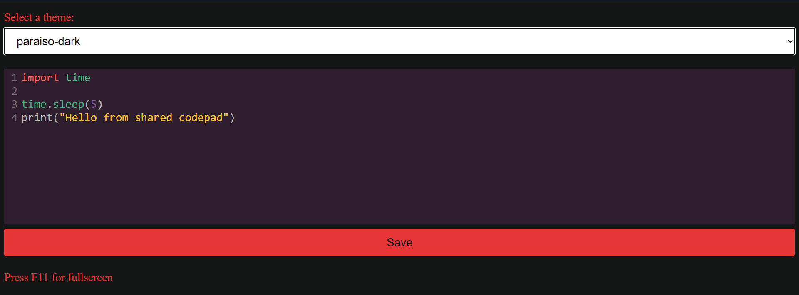

# SharedCode
 
Easily deployable shared codepad, coded from scratch in one day.
 
Resources used: CodeMirror syntax highlighting and themes.
 
Check out live demo at <a href='https://held-quintessential-myrtle.glitch.me/'>https://held-quintessential-myrtle.glitch.me/</a>

