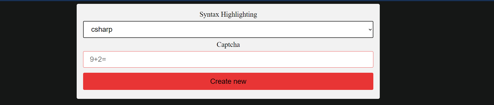

# SharedCode
 
Easily deployable shared codepad.
 
Resources used: CodeMirror syntax highlighting and themes.
 
Check out live demo at <a href='https://held-quintessential-myrtle.glitch.me/'>https://held-quintessential-myrtle.glitch.me/</a>

Live coding update:
- SSE (Server sent events), sync changes using merge button
- SocketIO + SSE allowing real time updating

